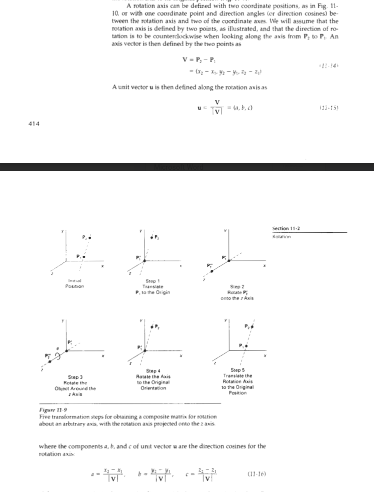
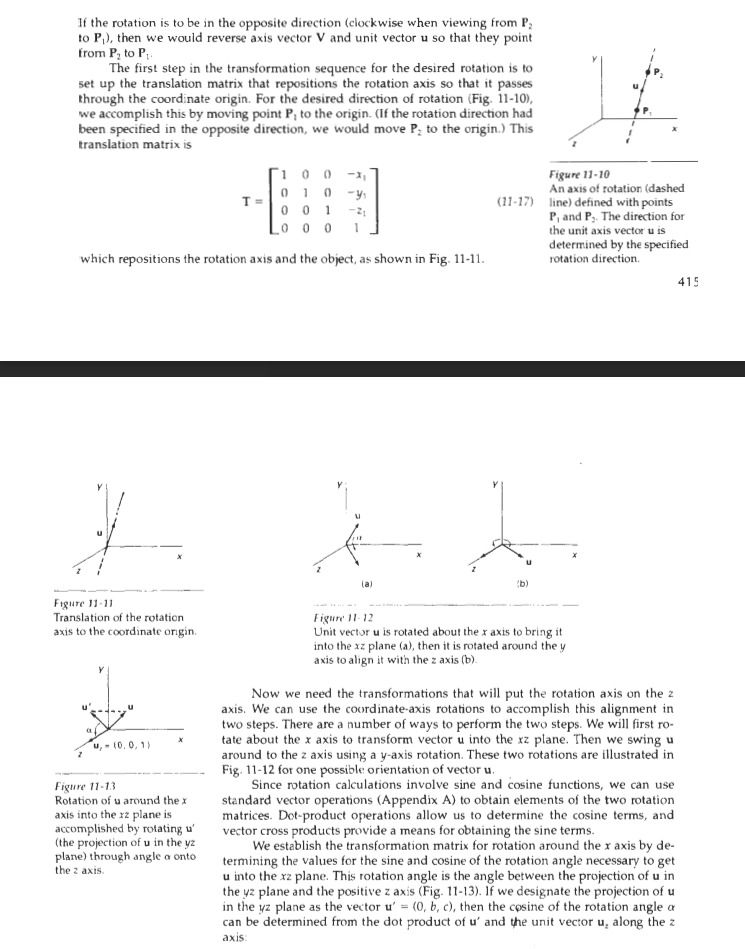
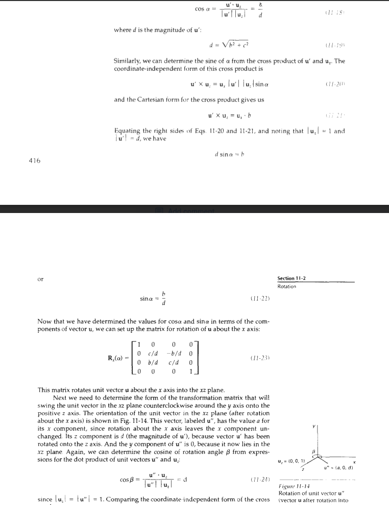
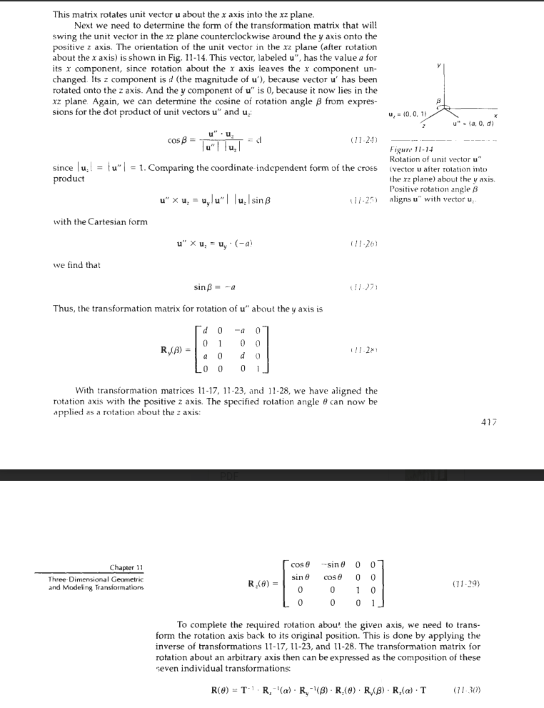
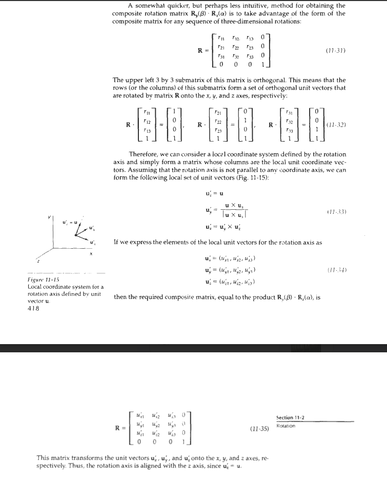

# 3D Arbitrary Axis Rotation - Complete Project Guide

## Project Overview

**Student Profile:**
- Undergraduate graphics course project
- 3 weeks maximum timeline (part-time)
- Viva defense required
- Recent lecture on 3D rotation about arbitrary axis
- Wants to deeply understand the concept through implementation

**Project Goal:**
Interactive 3D visualizer demonstrating rotation of objects about an arbitrary axis in 3D space using transformation matrices and the Hearn & Baker method.

**Technology:** Python + Pygame (3D graphics from scratch, no OpenGL)

---

## Why This Project is Perfect for Graphics Course

### ✅ **Core Graphics Concepts Covered:**

1. **3D Transformations**
   - Translation matrices (4×4)
   - Rotation matrices about X, Y, Z axes
   - Composite transformations (matrix multiplication)

2. **Homogeneous Coordinates**
   - 4D representation (x, y, z, w) where w=1
   - Enables translation as matrix multiplication
   - Foundation of transformation pipelines

3. **3D to 2D Projection**
   - Perspective projection
   - Camera transformations
   - Viewport mapping

4. **Vector Mathematics**
   - Vector normalization
   - Dot product and cross product
   - Angle calculations

5. **Rendering Techniques**
   - Wireframe rendering
   - Depth sorting (painter's algorithm)
   - Transparency/alpha blending

6. **Interactive 3D Graphics**
   - Camera controls (orbit, zoom)
   - Real-time transformations
   - User interaction

**This directly implements lecture material on arbitrary axis rotation!**

---

## Absolute line rotation

# Resources from book 
[ Donald Hearn, M. Pauline Baker] Computer Graphics( Book Fi.org)







**Problem:** Rotate a point P about an arbitrary axis defined by two points P1 and P2.

**Solution:** Transform the problem into a simpler one (rotation about Z-axis), then reverse.

### **Step 1: Translate to Origin**
- Move P1 to origin (0, 0, 0)
- Translation matrix: T(-P1.x, -P1.y, -P1.z)
- **Why?** Rotations are easier when axis passes through origin

### **Step 2: Rotate to XZ Plane**
- Rotate about X-axis by angle α
- Aligns axis direction vector with XZ plane (makes y-component = 0)
- Calculate: α = arctan(b/c) where axis direction = (a, b, c)

### **Step 3: Rotate to Z-axis**
- Rotate about Y-axis by angle β  
- Aligns axis with positive Z-axis
- Calculate: β = arctan(a/d) where d = √(b² + c²)

### **Step 4: Perform Desired Rotation**
- Rotate about Z-axis by angle θ (the rotation we actually want!)
- This is now trivial since axis is aligned with Z

### **Step 5: Reverse All Transformations**
- Apply inverse transformations in reverse order:
  - Rotate about Y-axis by -β
  - Rotate about X-axis by -α
  - Translate by +P1

**Final transformation:** T⁻¹ · Rx⁻¹ · Ry⁻¹ · Rz(θ) · Ry · Rx · T

---

## 3-Week Timeline (Part-Time)

### **Week 1: Foundation (Days 1-7)**

#### **Day 1-2: 3D Coordinate System ✅**
**Goal:** Display rotatable 3D coordinate system

**Implementation:**
- Pygame window setup
- 3D point rotation (camera pitch/yaw)
- Perspective projection (3D → 2D)
- Draw XYZ axes with colors and labels
- Camera controls (WASD + QE zoom)

**Deliverables:**
- Working 3D axes visualization
- Smooth camera rotation
- Understanding of projection math

**Key Concepts:**
```python
# Perspective projection formula
screen_x = center_x + (x * scale) / (z + camera_distance)
screen_y = center_y - (y * scale) / (z + camera_distance)

# Camera rotation (pitch and yaw)
# Rotate around Y-axis (yaw), then X-axis (pitch)
```

---

#### **Day 3-4: Coordinate Planes & Objects**
**Goal:** Add transparent planes and render a cube

**Implementation:**
- Draw XY, XZ, YZ planes with transparency
- Create cube vertices and edges
- Implement depth sorting (painter's algorithm)
- Draw 3D wireframe cube

**Deliverables:**
- Transparent coordinate planes (like reference image)
- Rotating cube at origin
- Z-ordering working correctly

**Key Concepts:**
```python
# Cube vertices
vertices = [
    (-1, -1, -1), (1, -1, -1), (1, 1, -1), (-1, 1, -1),  # Back
    (-1, -1, 1), (1, -1, 1), (1, 1, 1), (-1, 1, 1)       # Front
]

# Painter's algorithm
# Sort objects by average Z-depth, draw farthest first
```

---

#### **Day 5-7: Transformation Matrices**
**Goal:** Implement core transformation functions

**Implementation:**
- Translation matrix function
- Rotation matrices (X, Y, Z axes)
- Matrix multiplication
- Apply transformation to point
- Test: rotate cube around each axis

**Deliverables:**
- Working matrix library
- Cube rotates around X, Y, Z axes correctly
- Matrix multiplication verified

**Key Functions:**
```python
def translation_matrix(tx, ty, tz):
    """4x4 translation matrix"""
    return [[1, 0, 0, tx],
            [0, 1, 0, ty],
            [0, 0, 1, tz],
            [0, 0, 0, 1]]

def rotation_x_matrix(angle):
    """Rotation about X-axis"""
    c, s = cos(angle), sin(angle)
    return [[1, 0,  0, 0],
            [0, c, -s, 0],
            [0, s,  c, 0],
            [0, 0,  0, 1]]

def apply_matrix(point, matrix):
    """Transform point by matrix"""
    # Convert to homogeneous: [x, y, z, 1]
    # Multiply: result = matrix @ [x, y, z, 1]
    # Return: (x', y', z')
```

---

### **Week 2: Arbitrary Axis Rotation (Days 8-14)**

#### **Day 8-9: Step 1 - Translation**
**Goal:** Implement and visualize Step 1

**Implementation:**
- Define arbitrary axis (P1, P2 points)
- Draw axis as bright yellow line
- Translate P1 to origin
- Show before/after with ghosting

**Deliverables:**
- Axis visualization
- Translation working
- Visual comparison

**Visualization:**
- Original position (light gray ghost)
- After translation (full color)
- Axis moves so P1 is at origin

---

#### **Day 10-11: Steps 2-3 - Alignment Rotations**
**Goal:** Implement angle calculations and rotations

**Implementation:**
- Calculate α angle (align to XZ plane)
- Calculate β angle (align to Z-axis)
- Implement Step 2 (rotate by -α about X)
- Implement Step 3 (rotate by -β about Y)
- Visualize angles with arcs

**Deliverables:**
- Correct angle calculations
- Axis aligns with Z-axis after Step 3
- Angle arcs displayed

**Key Formulas:**
```python
# Axis direction vector after Step 1: u = P2 - P1
u = normalize(P2 - P1)  # (a, b, c)

# Step 2: Align to XZ plane
d = sqrt(b² + c²)
if d > 0:
    cos_α = c / d
    sin_α = b / d
    α = atan2(sin_α, cos_α)

# Step 3: Align to Z-axis  
cos_β = d  # d = sqrt(b² + c²) from before
sin_β = a
β = atan2(sin_β, cos_β)
```

---

#### **Day 12-13: Step 4-5 - Rotation & Inverse**
**Goal:** Complete the algorithm

**Implementation:**
- Step 4: Rotate about Z-axis by θ
- Step 5: Apply inverse transformations
- Combine all matrices into single composite
- Animate continuous rotation

**Deliverables:**
- Full rotation working correctly
- Smooth animation
- Composite matrix calculated

**Matrix Order (CRITICAL):**
```python
# Forward transformations
M_forward = Ry(-β) @ Rx(-α) @ T(-P1)

# Rotation about aligned Z-axis
M_rotate = Rz(θ)

# Inverse transformations
M_inverse = T(+P1) @ Rx(+α) @ Ry(+β)

# Complete transformation
M_total = M_inverse @ M_rotate @ M_forward
```

---

#### **Day 14: Step-Through System**
**Goal:** Add educational step visualization

**Implementation:**
- Keyboard controls to step through (arrow keys)
- Display current step name
- Show relevant angles for each step
- Pause/play animation

**Deliverables:**
- Step-by-step navigation
- Clear step indicators
- Educational annotations

---

### **Week 3: Enhancement & Polish (Days 15-21)**

#### **Day 15-16: Interactive Axis Definition**
**Goal:** Let user define custom axis

**Implementation:**
- Click to set P1 (first click)
- Click to set P2 (second click)
- Real-time axis update
- Visual feedback for click mode

**Deliverables:**
- Point selection working
- Axis updates immediately
- Clear UI indicators

---

#### **Day 17: Multiple Objects**
**Goal:** Add variety of objects to rotate

**Implementation:**
- Pyramid/tetrahedron
- Octahedron  
- Custom letter/shape
- Object selector UI

**Deliverables:**
- 3-4 different objects
- Selector buttons/keys
- All objects rotate correctly

**Object Templates:**
```python
# Pyramid (square base)
pyramid_vertices = [
    (-1, 0, -1), (1, 0, -1), (1, 0, 1), (-1, 0, 1),  # Base
    (0, 2, 0)  # Apex
]

# Tetrahedron (4 faces)
tetrahedron_vertices = [
    (1, 1, 1), (-1, -1, 1), (-1, 1, -1), (1, -1, -1)
]
```

---

#### **Day 18: UI & Controls Polish**
**Goal:** Professional interface

**Implementation:**
- Control panel with instructions
- Slider for rotation angle θ
- Buttons for common operations
- Color-coded legends
- Status display

**UI Elements:**
- Step progress indicator
- Angle displays (α, β, θ)
- Camera info (pitch, yaw, zoom)
- Legend for colors

---

#### **Day 19: Matrix Display (Educational)**
**Goal:** Show actual transformation matrices

**Implementation:**
- Display current transformation matrix (4×4)
- Highlight non-zero/identity elements
- Toggle on/off with key press
- Format numbers cleanly

**Deliverables:**
- Matrix overlay panel
- Clear formatting
- Updates in real-time

**Display Format:**
```
Current Matrix (Step 3):
┌                           ┐
│  0.87  0.00  0.50   0.00 │
│  0.00  1.00  0.00   0.00 │
│ -0.50  0.00  0.87   0.00 │
│  0.00  0.00  0.00   1.00 │
└                           ┘
```

---

#### **Day 20: Comparison View**
**Goal:** Show before/after simultaneously

**Implementation:**
- Ghost image of original position
- Side-by-side view option
- Trail effect for rotation path

**Deliverables:**
- Visual comparison working
- Toggle ghost/trail modes
- Clear differentiation

---

#### **Day 21: Documentation & Final Polish**
**Goal:** Code cleanup and viva preparation

**Tasks:**
- Comment every function thoroughly
- Write README with usage instructions
- Create concept explanation document
- Test all features
- Fix any remaining bugs
- Optimize performance if needed

**Documentation Sections:**
1. How to run the program
2. Controls reference
3. Mathematical concepts explained
4. Code structure overview
5. Known limitations

---

## Core Concepts for Viva Defense

### **1. Why Homogeneous Coordinates?**

**Question:** "Why use 4×4 matrices instead of 3×3?"

**Answer:**
- 3×3 matrices can only represent rotation and scaling (linear transformations)
- Translation requires addition: P' = P + T
- Can't chain translations with rotations using only 3×3 matrices
- Homogeneous coordinates (x, y, z, w) with 4×4 matrices unify all transformations
- Now translation is multiplication: P' = M × P
- Enables composite transformations: M_total = M3 × M2 × M1

---

### **2. Why the 5-Step Process?**

**Question:** "Why not just rotate directly about the arbitrary axis?"

**Answer:**
- Direct rotation formula exists (Rodrigues' rotation formula) but it's complex
- 5-step method is conceptually clearer and easier to implement
- Breaks complex problem into simple, well-understood operations
- Each step uses standard rotation matrices
- Educational value: shows how complex transformations decompose
- Same approach used in robotics, animation, CAD software

---

### **3. Matrix Multiplication Order**

**Question:** "Why does order matter in matrix multiplication?"

**Answer:**
- Matrix multiplication is NOT commutative: A × B ≠ B × A
- Transformations apply right-to-left in the multiplication chain
- Example: Translate then rotate ≠ Rotate then translate
- Must reverse order for inverse transformations
- In our algorithm: M = T⁻¹ · Rx⁻¹ · Ry⁻¹ · Rz(θ) · Ry · Rx · T

**Demonstration:**
```
Rotate 90° about Z, then translate by (1, 0, 0):
  Point (1, 0) → Rotate → (0, 1) → Translate → (1, 1)

Translate by (1, 0, 0), then rotate 90° about Z:
  Point (1, 0) → Translate → (2, 0) → Rotate → (0, 2)

Different results! Order matters.
```

---

### **4. Perspective Projection**

**Question:** "How do you convert 3D coordinates to 2D screen?"

**Answer:**
- Use perspective projection: objects farther away appear smaller
- Formula: screen_x = (x / z) × scale, screen_y = (y / z) × scale
- Add camera distance to avoid division by zero: z_camera = z + distance
- This creates depth illusion: distant objects shrink
- Alternative: Orthographic projection (no perspective, parallel lines stay parallel)

---

### **5. Depth Sorting**

**Question:** "How do you handle overlapping objects in 3D?"

**Answer:**
- Painter's algorithm: Draw farthest objects first
- Calculate average Z-depth for each object
- Sort by depth (descending)
- Draw in sorted order
- Limitation: Doesn't handle interpenetrating objects perfectly
- Alternative: Z-buffer (per-pixel depth testing, more accurate but complex)

---

## Technical Specifications

### **Coordinate System**
- Right-handed coordinate system
- X-axis: Red (points right)
- Y-axis: Green (points up)
- Z-axis: Blue (points toward viewer)
- Origin at screen center

### **Camera Controls**
- W/S: Pitch (rotate up/down around X-axis)
- A/D: Yaw (rotate left/right around Y-axis)
- Q/E: Zoom in/out
- R: Reset to default view

### **Transformation Controls**
- Space: Play/Pause animation
- Left/Right arrows: Step backward/forward
- Up/Down arrows: Adjust rotation angle θ
- 1-5 keys: Jump to specific step
- C: Toggle axis point selection mode
- M: Toggle matrix display

### **Default Parameters**
- Camera distance: 10 units
- Initial pitch: 30°
- Initial yaw: 45°
- Scale/zoom: 100
- Default axis: P1=(1, 0.5, 0.5), P2=(3, 2, 2.5)
- Rotation angle increment: 2° per frame

### **Performance Targets**
- 60 FPS with single object
- < 30ms per frame for all calculations
- Smooth camera rotation
- No visible lag in transformations

---

## File Structure

```
3d-rotation/
├── rotation3d.py           # Main application
├── matrices.py             # Matrix operations library
├── objects.py              # 3D object definitions
├── README.md              # User guide
├── CONCEPTS.md            # Mathematical explanations
└── screenshots/           # Demo images for documentation
```

**Single-file approach (recommended for submission):**
- Keep everything in `rotation3d.py` for easy sharing
- Well-commented sections
- Clear function organization

---

## Code Structure

### **Main Components:**

```python
# 1. INITIALIZATION
#    - Pygame setup, colors, fonts
#    - Global parameters (camera, scale, etc.)

# 2. MATRIX OPERATIONS
#    - translation_matrix(tx, ty, tz)
#    - rotation_x_matrix(angle)
#    - rotation_y_matrix(angle)
#    - rotation_z_matrix(angle)
#    - multiply_matrices(A, B)
#    - apply_transformation(point, matrix)

# 3. 3D GRAPHICS
#    - rotate_point(point, pitch, yaw)        # Camera rotation
#    - project_3d(point)                      # 3D → 2D projection
#    - draw_line_3d(start, end, color)
#    - draw_point_3d(point, color, size)

# 4. COORDINATE SYSTEM
#    - draw_axes()                            # XYZ axes
#    - draw_planes()                          # XY, XZ, YZ planes
#    - draw_grid()                            # Grid lines

# 5. HEARN & BAKER ALGORITHM
#    - calculate_alpha(axis_vector)           # Step 2 angle
#    - calculate_beta(axis_vector)            # Step 3 angle
#    - step1_translate(point, P1, P2)
#    - step2_align_xz(point, P1, P2)
#    - step3_align_z(point, P1, P2)
#    - step4_rotate_z(point, P1, P2, theta)
#    - step5_inverse(point, P1, P2, theta)

# 6. OBJECTS
#    - create_cube(center, size)
#    - create_pyramid(center, size)
#    - draw_object(vertices, edges, color)

# 7. UI & VISUALIZATION
#    - draw_ui_panel()                        # Control panel
#    - draw_step_indicator()                  # Progress display
#    - draw_angle_arc()                       # Visual angle
#    - draw_matrix_overlay()                  # Matrix display

# 8. MAIN LOOP
#    - Event handling (keyboard, mouse)
#    - State updates
#    - Rendering pipeline
#    - Frame timing
```

---

## Common Issues & Solutions

### **Issue 1: Objects appear flipped or mirrored**
**Cause:** Incorrect rotation matrix or projection formula  
**Solution:** 
- Check rotation direction (right-hand rule)
- Verify Y-axis flip in projection (screen Y is inverted)
- Test each rotation matrix individually

### **Issue 2: Transformations in wrong order**
**Cause:** Matrix multiplication order  
**Solution:**
- Remember: Rightmost matrix applies first
- For inverse: Reverse the order AND negate angles
- Test: T · R ≠ R · T (verify with simple example)

### **Issue 3: Division by zero in projection**
**Cause:** Point at or behind camera (z ≤ 0)  
**Solution:**
- Add camera distance before projection: z_cam = z + distance
- Clamp minimum z: `if z < 0.1: z = 0.1`
- Filter out points behind camera

### **Issue 4: Gimbal lock or discontinuous rotation**
**Cause:** Angle calculations near singularities  
**Solution:**
- Use `atan2(y, x)` instead of `atan(y/x)` (handles all quadrants)
- Check for zero denominators: `if d < 1e-10: d = 1e-10`
- Handle special case: axis already aligned with Z

### **Issue 5: Transparent planes don't overlap correctly**
**Cause:** Drawing order  
**Solution:**
- Calculate average Z for each plane
- Sort planes by depth (farthest first)
- Draw in sorted order
- Use pygame.Surface with SRCALPHA for transparency

### **Issue 6: Performance is slow (low FPS)**
**Cause:** Too many calculations or draw calls  
**Solution:**
- Pre-calculate matrices (don't recalculate every frame)
- Reduce object complexity
- Use integer coordinates where possible
- Profile code to find bottlenecks

---

## Mathematical Reference

### **Rotation Matrices**

**About X-axis (angle θ):**
```
Rx(θ) = │ 1    0        0      0 │
        │ 0  cos(θ)  -sin(θ)  0 │
        │ 0  sin(θ)   cos(θ)  0 │
        │ 0    0        0      1 │
```

**About Y-axis (angle θ):**
```
Ry(θ) = │  cos(θ)  0  sin(θ)  0 │
        │    0     1    0     0 │
        │ -sin(θ)  0  cos(θ)  0 │
        │    0     0    0     1 │
```

**About Z-axis (angle θ):**
```
Rz(θ) = │ cos(θ)  -sin(θ)  0  0 │
        │ sin(θ)   cos(θ)  0  0 │
        │   0        0     1  0 │
        │   0        0     0  1 │
```

### **Translation Matrix**

```
T(tx, ty, tz) = │ 1  0  0  tx │
                │ 0  1  0  ty │
                │ 0  0  1  tz │
                │ 0  0  0   1 │
```

### **Matrix Multiplication (4×4)**

```
C = A × B

C[i][j] = Σ(k=0 to 3) A[i][k] × B[k][j]
```

### **Vector Operations**

**Normalization:**
```
norm = √(x² + y² + z²)
normalized = (x/norm, y/norm, z/norm)
```

**Dot Product:**
```
u · v = ux×vx + uy×vy + uz×vz
```

**Cross Product:**
```
u × v = (uy×vz - uz×vy,
         uz×vx - ux×vz,
         ux×vy - uy×vx)
```

---

## Testing Checklist

### **Week 1 Completion:**
- [ ] 3D axes render correctly
- [ ] Camera rotation smooth (W/A/S/D)
- [ ] Zoom working (Q/E)
- [ ] Coordinate planes visible with transparency
- [ ] Cube renders at origin
- [ ] All transformations tested individually

### **Week 2 Completion:**
- [ ] Arbitrary axis defined (P1, P2)
- [ ] Step 1: Translation working
- [ ] Step 2: Alignment to XZ plane correct
- [ ] Step 3: Alignment to Z-axis correct
- [ ] Step 4: Z-rotation working
- [ ] Step 5: Inverse transformations correct
- [ ] Full algorithm produces correct rotation
- [ ] Step-through navigation working
- [ ] Angles displayed correctly

### **Week 3 Completion:**
- [ ] Click-to-define axis working
- [ ] Multiple objects selectable
- [ ] UI professional and clear
- [ ] Matrix display functional
- [ ] Comparison view working
- [ ] All controls documented
- [ ] No crashes or bugs
- [ ] Code fully commented
- [ ] Documentation complete
- [ ] Ready for demo

---

## Viva Preparation Strategy

### **Day Before Viva:**
1. **Run through full demo** (practice multiple times)
2. **Test all features** (make sure nothing breaks)
3. **Review concept document** (refresh mathematical understanding)
4. **Prepare to explain every function** (choose 2-3 to explain in detail)
5. **Think of potential questions** (see below)

### **Potential Viva Questions:**

**Conceptual:**
- Explain the Hearn & Baker method in your own words
- Why do we need homogeneous coordinates?
- What's the difference between world space and camera space?
- How does perspective projection work?

**Implementation:**
- Walk me through your rotation_x_matrix function
- Explain how you calculate the α angle
- What happens in Step 5? Why is it needed?
- How do you handle the camera rotation?

**Demonstration:**
- Show me rotation about the Z-axis only
- Change the axis to be horizontal - what changes?
- What happens when P1 and P2 are very close?
- Can you rotate multiple objects simultaneously?

**Troubleshooting:**
- What was the hardest bug you encountered?
- How did you verify your matrices were correct?
- What would you improve given more time?

---

## Extension Ideas (If You Finish Early)

1. **Rodriguez's Formula** - Implement direct arbitrary axis rotation
2. **Quaternion Rotation** - Alternative to Euler angles
3. **Animation Recording** - Save rotation as video/GIF
4. **Mesh Import** - Load OBJ files to rotate complex models
5. **Lighting** - Add simple diffuse lighting to objects
6. **Multiple Axes** - Rotate about 2 different axes simultaneously
7. **Interpolation** - Smooth transition between orientations (slerp)

---

## Resources & References

### **Textbook References:**
- Hearn & Baker: "Computer Graphics with OpenGL" - Chapter on 3D Transformations
- Foley et al.: "Computer Graphics: Principles and Practice" - Transformations chapter

### **Online Resources:**
- 3D Rotation Converter: https://www.andre-gaschler.com/rotationconverter/
- Rotation Matrix Visualizer: https://www.geogebra.org/m/yqvmpwcr
- Matrix Multiplication Practice: https://www.mathsisfun.com/algebra/matrix-multiplying.html

### **Pygame Documentation:**
- Official Pygame Docs: https://www.pygame.org/docs/
- Pygame Drawing: https://www.pygame.org/docs/ref/draw.html

---

## Success Criteria

**Minimum Viable Project (Must Have):**
- ✅ 3D coordinate system with rotatable camera
- ✅ Arbitrary axis defined by two points
- ✅ Complete 5-step transformation working
- ✅ At least one object rotating correctly
- ✅ Step-through visualization
- ✅ Clear controls and UI

**Good Project (Should Have):**
- ✅ All of above plus:
- ✅ Smooth animation
- ✅ Angle visualizations (arcs)
- ✅ Multiple objects
- ✅ Professional UI
- ✅ Comprehensive documentation

**Excellent Project (Could Have):**
- ✅ All of above plus:
- ✅ Interactive axis definition
- ✅ Matrix display overlay
- ✅ Comparison views
- ✅ Polished animations
- ✅ No bugs, smooth experience

---

## Current Progress Tracking

### **Completed:**
- [x] Project planning and timeline
- [x] Comprehensive guide created

### **Week 1 (Days 1-7):**
- [ ] Day 1: 3D axes and camera (IN PROGRESS)
- [ ] Day 2: Camera refinement
- [ ] Day 3: Coordinate planes
- [ ] Day 4: Cube object
- [ ] Day 5: Translation matrix
- [ ] Day 6: Rotation matrices
- [ ] Day 7: Test all matrices

### **Week 2 (Days 8-14):**
- [ ] Day 8: Step 1 implementation
- [ ] Day 9: Step 1 visualization
- [ ] Day 10: Step 2 implementation
- [ ] Day 11: Step 3 implementation
- [ ] Day 12: Step 4 implementation
- [ ] Day 13: Step 5 implementation
- [ ] Day 14: Step controls

### **Week 3 (Days 15-21):**
- [ ] Day 15: Interactive axis
- [ ] Day 16: Axis interaction polish
- [ ] Day 17: Multiple objects
- [ ] Day 18: UI enhancement
- [ ] Day 19: Matrix display
- [ ] Day 20: Comparison view
- [ ] Day 21: Final polish & documentation

---

## Notes for Continuation

**If resuming with new Claude:**
1. Share this document + current code file
2. State: "Working on 3D arbitrary axis rotation project, currently on Day X"
3. Describe any issues encountered
4. Request next step guidance

**For new Claude:**
- Follow incremental teaching methodology
- Check understanding after each concept
- Provide explanations before code
- Test each feature before moving forward
- Keep focus on graphics concepts for viva preparation

---

*Last Updated: Day 1 - Started 3D axes implementation*
*Timeline: 3 weeks maximum*
*Next: Complete Day 1 camera controls and projection*